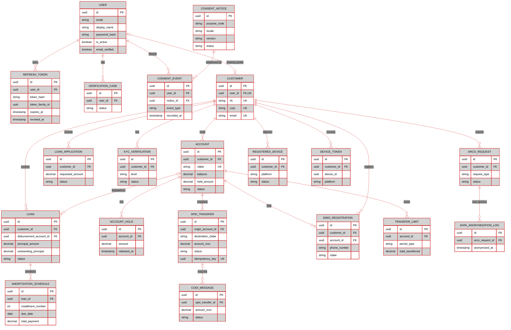
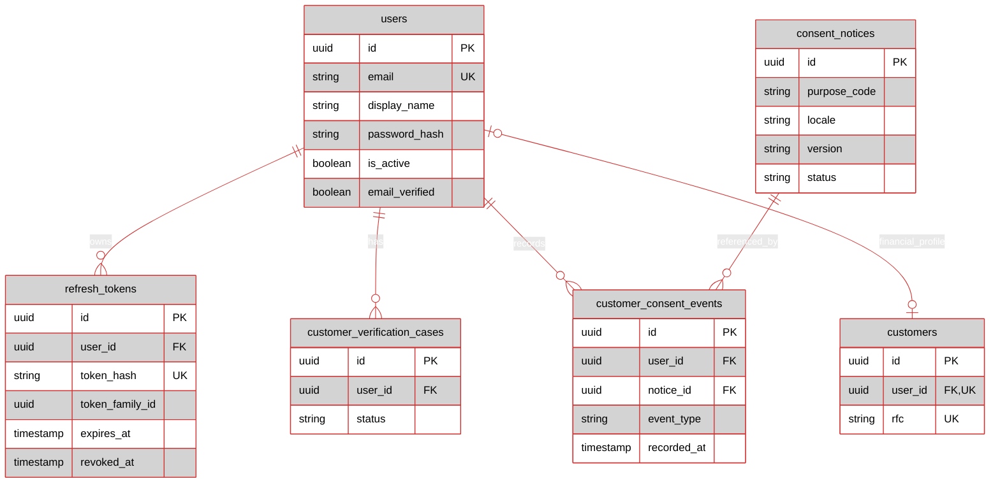
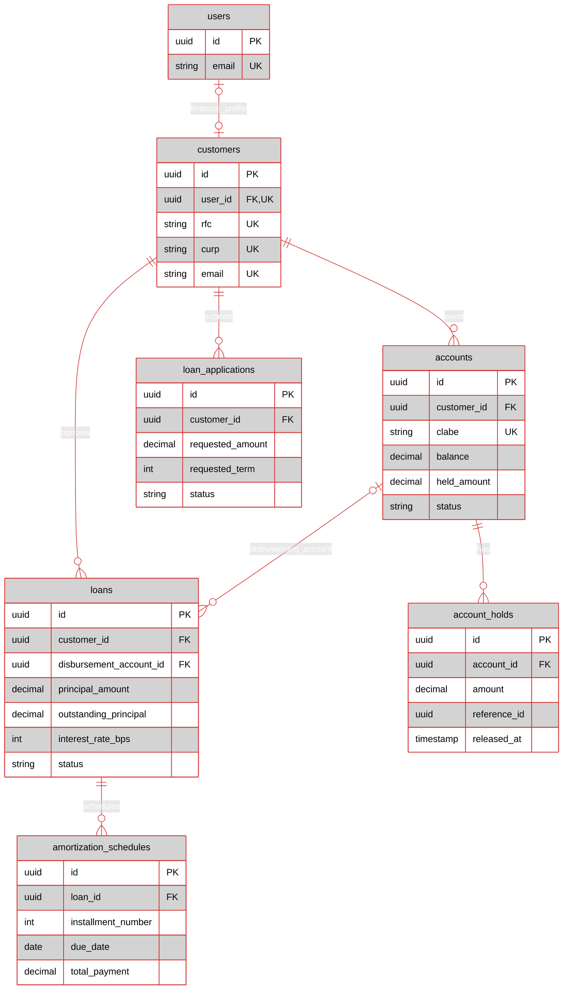
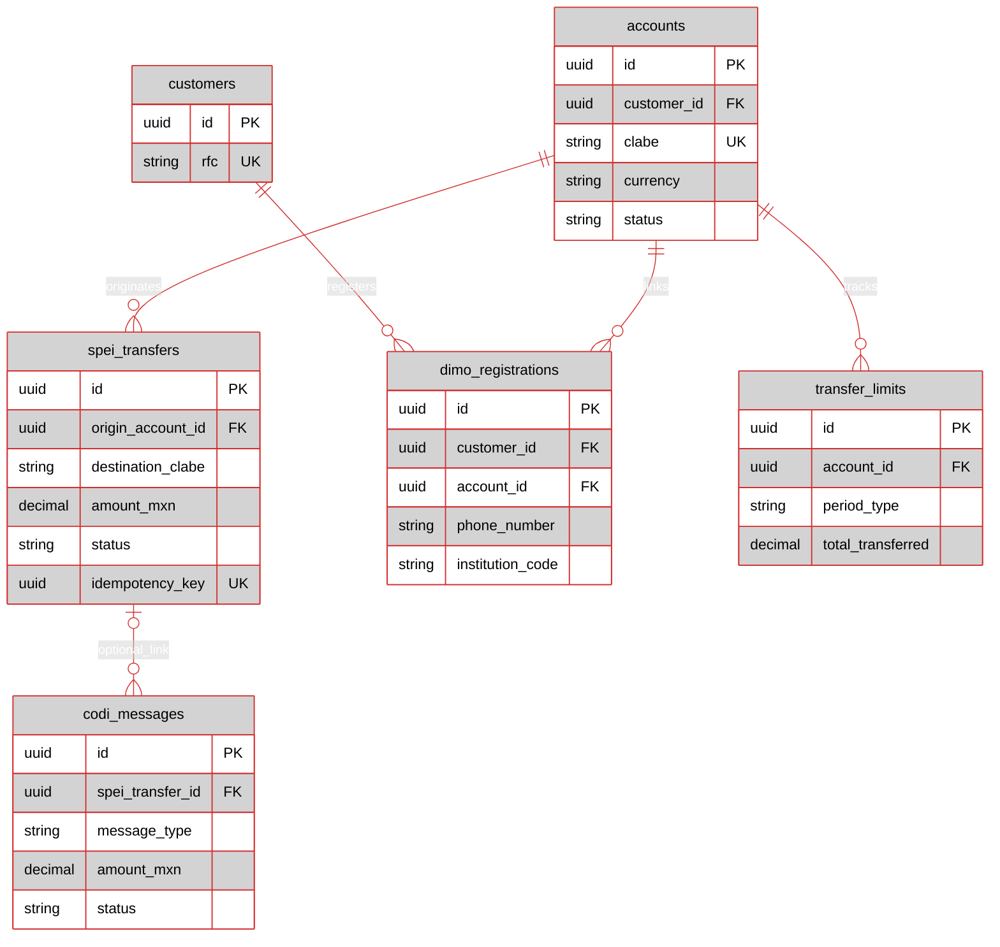

# Fintech Data Model

> **Status:** schema reference. Authentication (``/signup``,`` /login``, ``/refresh``,
``/logout``, ``/logout-all``, ``/me``) and the consent registry API
(``/consents/notices``, ``/me/consents``, ``/consents``) are implemented and
covered by container-backed integration tests. Account, loan, transfer, and
repayment API workflows are not implemented.

## At a Glance

| Area | Main tables | What they represent | Runtime |
| --- | --- | --- | --- |
| Identity | `users`, `refresh_tokens` | Login identity and session state | Implemented |
| Consent | `consent_notices`, `customer_consent_events` | Versioned notices and append-only user consent evidence | Implemented |
| Onboarding | `customer_verification_cases` | KYC case lifecycle (schema ready, route not wired) | Schema only |
| Accounts | `customers`, `accounts`, `account_holds` | Customer ownership, account state, held funds | Not implemented |
| Lending | `loan_applications`, `loans`, `amortization_schedules` | Applications, issued-loan records, installments | Not implemented |
| Payments | `spei_transfers`, `codi_messages`, `dimo_registrations`, `transfer_limits` | Transfer instructions and rail metadata | Not implemented |
| Compliance | `kyc_verifications`, `arco_requests`, `data_anonymization_log`, `registered_devices`, `device_tokens` | KYC evidence, privacy rights, device registry | Not implemented |
| Read models | `account_balances`, `loan_summary`, `transaction_history`, `sync_changes`, `delinquency_report` | Rebuildable query projections | Not implemented |
| Supporting | Events, outbox, idempotency, audit, regulatory | Infrastructure for future phases | Not implemented |

> [!WARNING]
> These tables exist in PostgreSQL, but their presence does not mean the runtime can create accounts, issue loans, or move money.

## Entity-Relationship Diagrams

### Full Schema

The complete model includes identity, consent, KYC, privacy, account, loan,
and payment tables. Entities use the Rho `dataNode` style: light-gray fill,
black text, and red borders. The same diagram is available as a standalone
[Mermaid source file](datamaodel.mmd).

The smaller diagrams below are intentionally focused views: they isolate
account/loan and payment relationships so developers can inspect those parts
without the full diagram's visual density. Boxes are entities, attributes are
columns, and crow's-foot markers show foreign-key cardinality.

### Identity and Sessions

The Identity area is the only one fully wired to HTTP routes. `users` is the
authentication anchor; ``customers`` links to it optionally via ``user_id``.
``refresh_tokens`` uses ``token_family_id`` to group all refresh tokens issued
within one login session — the reuse-detection model lives there.

### Accounts and Loans

> [!IMPORTANT]
> `loan_applications` has no foreign key to `loans`; approval-to-loan conversion is not modeled as a database relationship. The account-to-loan relationship is optional on the loan side because `disbursement_account_id` is nullable.

### Payment Rails

## Table Reference

### Identity and Sessions (Implemented)

| Table | Key data and rules |
| --- | --- |
| `users` | Authentication anchor. Unique case-insensitive index on `lower(email)`. Argon2id `password_hash`. `is_active` and `email_verified` gate login. Signup currently sets `email_verified = true` for dev convenience; production must flip this and add a verification flow. |
| `refresh_tokens` | SHA-256 hash of each issued refresh token, grouped by `token_family_id`. Rotation revokes the previous row and inserts a new one in the same family. Any reuse of a revoked token triggers family-wide revocation in the handler. Partial index on `(token_family_id, expires_at) WHERE revoked_at IS NULL` powers the session-liveness check. |
| `customer_verification_cases` | KYC case per user. Unique partial index enforces one open case (`pending`, `manual_review`) per user. Schema ready; `routes/onboarding.rs` handlers exist but are not registered in `build_app`. |

### Consent Registry (Implemented)

| Table | Key data and rules |
| --- | --- |
| `consent_notices` | Versioned notice content. Unique per `(purpose_code, locale, version)`. Only one published notice per `(purpose_code, locale)`. A trigger enforces that `content_sha256` matches `content` and that published/retired notices are immutable. Retire, don't delete — a second trigger blocks DELETE entirely. |
| `customer_consent_events` | Append-only evidence of grant/withdraw. UPDATE and DELETE blocked by trigger. Current state = latest event by `(recorded_at DESC, id DESC)`. The consent API writes here, not to the legacy `consent_records`. |

### Financial Domain (Schema Only)

| Table | Key data and rules |
| --- | --- |
| `customers` | Optional unique `user_id` link to the authenticated identity, RFC, optional CURP, contact details, KYC level, privacy and screening metadata. Existing rows remain unlinked until verified. |
| `accounts` | Customer, account number, CLABE, type, currency, balance, held amount, status. Account number and CLABE are unique. |
| `account_holds` | Positive amount, reason, optional reference and expiry/release timestamps. `reference_id` is not a foreign key. |
| `loan_applications` | Customer, requested amount/term, purpose, status, limited decision fields. Amount and term must be positive. |
| `loans` | Customer, optional disbursement account, principal, outstanding principal, rate in basis points, term, currency, status and lifecycle dates. |
| `amortization_schedules` | Loan installments with due date, principal/interest portions, total, remaining balance and optional payment details. Installment number is unique per loan. |
| `spei_transfers` | Origin account, destination CLABE, positive MXN amount, rail/status, tracking references, unique idempotency key and timestamps. |
| `codi_messages` | Optional SPEI link, message type, QR payload, MXN/UDI amounts, status and expiry. DDL includes a 6,000-UDI ceiling. |
| `dimo_registrations` | Customer/account, phone, CLABE and institution. Phone/institution pair is unique. |
| `transfer_limits` | Per-account daily/monthly totals and counts. Stored totals do not themselves enforce a limit. |

### Compliance (Schema Only)

| Table | Key data and rules |
| --- | --- |
| `kyc_verifications` | Append-only KYC evidence per `(customer, level)` with validations, document references and audit fields. Supersedes nothing — this is the evidence table that `customer_verification_cases` refers to conceptually but does not FK to. |
| `arco_requests` | LFPDPPP Access/Rectification/Cancellation/Opposition. 20-business-day SLA via `due_at`. `data_anonymization_log` references it. |
| `data_anonymization_log` | What was anonymized, when, and by whom for each fulfilled cancellation request. |
| `registered_devices` | Hardware-backed public key + attestation status per device. Unique `(device_id, customer_id)`. |
| `device_tokens` | Push tokens per device. Unique `(device_id, token)`. Invalidated tokens are retained, not deleted. |

### Status Values

| Entity | Values in schema |
| --- | --- |
| Account | `active`, `suspended`, `closed`, `frozen` |
| Loan application | `submitted`, `under_review`, `approved`, `rejected`, `expired` |
| Loan | `pending_disbursement`, `active`, `delinquent`, `paid_off`, `written_off` |
| Transfer | `initiated`, `pending`, `completed`, `failed`, `returned` |
| Verification case | `pending`, `manual_review`, `verified`, `rejected`, `cancelled` |
| Consent notice | `draft`, `published`, `retired` |
| Consent event | `granted`, `withdrawn` |
| ARCO request | `received`, `in_progress`, `completed`, `rejected`, `expired` |

## Read Models and Infrastructure

| Group | Tables | Interpretation |
| --- | --- | --- |
| Account projection | `account_balances`, `transaction_history` | Derived balance and activity views; not accounting authority |
| Loan projections | `loan_summary`, `delinquency_report` | Derived customer/operations summaries |
| Client sync | `sync_changes` | Change cursor groundwork; no `/sync` route is implemented |
| Event processing | `domain_events`, `aggregate_versions`, `aggregate_snapshots`, `outbox_events`, `projection_checkpoints` | Persistence groundwork; no complete worker/projection pipeline is implemented |
| Operations | `idempotency_keys`, `request_log`, `_sqlx_migrations` | Request/migration support; not evidence of working financial commands |

## Migration Layout

| # | File | Backs |
| --- | --- | --- |
| 1 | `1_extensions_and_types.sql` | `pgcrypto`, `pg_trgm`, `btree_gin`; all domain enums |
| 2 | `2_core_domain.sql` | `customers`, `accounts`, `account_holds`, `loans`, `loan_applications`, `amortization_schedules` |
| 3 | `3_event_store.sql` | `domain_events` (partitioned), `aggregate_versions`, `aggregate_snapshots`, `outbox_events` |
| 4 | `4_regulatory_compliance.sql` | `udi_values`, `aml_risk_profiles`, `uif_notices`, `regulatory_capital`, `cnbv_report_submissions` |
| 5 | `5_kyc_devices_and_arco.sql` | `kyc_verifications`, `arco_requests`, `data_anonymization_log`, `registered_devices`, `device_tokens` |
| 6 | `6_payment_rails.sql` | `spei_transfers`, `codi_messages`, `dimo_registrations`, `transfer_limits` |
| 7 | `7_read_models.sql` | `account_balances`, `loan_summary`, `transaction_history`, `sync_changes`, `delinquency_report` |
| 8 | `8_audit_and_operations.sql` | `idempotency_keys`, `request_log`, `projection_checkpoints`, `regulatory_calendar` |
| 9 | `9_rls_policies.sql` | Row-Level Security on `customers`, `accounts`, `loans`, `transaction_history`, `sync_changes`, `arco_requests` |
| 10 | `10_create_identity_sessions.sql` | `users`, `refresh_tokens` |
| 11 | `11_create_consent_registry.sql` | `consent_notices`, `customer_consent_events` |
| 12 | `12_create_verification_cases.sql` | `customer_verification_cases` |
| 13 | `13_link_customers_to_users.sql` | `customers.user_id` FK |

## Migration 1 — Extensions and Types

`migrations/1_extensions_and_types.sql`

### Extensions

| Extension | Provides | Used for |
| --- | --- | --- |
| `pgcrypto` | `gen_random_uuid()`, `digest()`, `gen_random_bytes()` | UUID PK defaults across the schema; SHA-256 check in `protect_consent_notice()` trigger |
| `pg_trgm` | Trigram similarity indexes | Fuzzy customer-name search, dedup when linking `customers.user_id` (future) |
| `btree_gin` | GIN indexes over scalar types | Composite GIN indexes mixing `customer_id` with JSONB (future) |

### Enums

| Enum | Values (declaration order) | Purpose | Used by |
| --- | --- | --- | --- |
| `kyc_level` | `nivel_1` → `nivel_2` → `nivel_3` → `nivel_4` | Ley Fintech Art. 115 KYC tiers | `customers.kyc_level`, `kyc_verifications.level` |
| `account_status` | `active` → `suspended` → `closed` → `frozen` | Account lifecycle, ordered by severity | `accounts.status` |
| `loan_status` | `pending_disbursement` → `active` → `delinquent` → `paid_off` → `written_off` | Loan lifecycle | `loans.status`, `loan_summary.status` |
| `application_status` | `submitted` → `under_review` → `approved` → `rejected` → `expired` | Loan application lifecycle (pre-loan) | `loan_applications.status` |
| `aml_risk_level` | `low` → `medium` → `high` | LFPIORPI risk classification | `aml_risk_profiles.risk_level` |
| `payment_rail` | `spei` → `codi` → `dimo` | Banxico rails | `spei_transfers.rail` |
| `transfer_status` | `initiated` → `pending` → `completed` → `failed` → `returned` | Transfer lifecycle | `spei_transfers.status` |
| `arco_request_type` | `access` → `rectification` → `cancellation` → `opposition` | LFPDPPP data subject rights | `arco_requests.request_type` |
| `arco_status` | `received` → `in_progress` → `completed` → `rejected` → `expired` | ARCO SLA lifecycle | `arco_requests.status` |
| `device_status` | `active` → `suspended` → `revoked` | Mobile device lifecycle | `registered_devices.status` |

### Notes

- **Declaration order is the sort order.** `ORDER BY status` on loans returns `pending_disbursement` first, `written_off` last — no `CASE` needed.
- **Enum vs. CHECK.** Native enums used where the vocabulary is regulator-fixed and sort order matters; `VARCHAR + CHECK` used for statuses expected to evolve (`consent_notices.status`, `customer_consent_events.event_type`).
- **`ALTER TYPE ... ADD VALUE` cannot run inside a transaction** on older PostgreSQL — Sqlx wraps migrations in a transaction, so future enum additions need a `DO $$ ... $$` block or type recreation.
- **`consent_method` removed** in the migration 5 cleanup alongside `consent_records`. Comment block kept for history.

## Migration 2 — Core Domain Tables

``migrations/2_core_domain.sql``

- Depends on: Migration 1.
- Consumed by: Migrations 3–13.

### Design patterns

- UUID v4 PKs throughout. No sequential integers — prevents enumeration, enables distributed generation.
- ``version BIGINT`` on every aggregate root. Optimistic-concurrency enabler. ``account_holds`` deliberately lacks it — holds are append-only.
- ``created_at`` / ``updated_at`` on every aggregate. No triggers auto-touch ``updated_at`` — the application must set it explicitly.
- Money as ``NUMERIC(18,2)``. 18 digits, 2 decimals. Never ``FLOAT``/``REAL``. UDI values use ``NUMERIC(12,6)``.
- Spanish regulatory identifiers kept verbatim. RFC, CURP, CLABE, CAT, UDI — the regulator's vocabulary, not translated.
- Positive-only amounts. Every monetary field has a CHECK: ``principal_amount > 0, account_holds.amount > 0``, etc.
- Format checks as regex, not application logic. RFC, CURP, CLABE all have ``CHECK (col ~ '...') ``— protects bulk imports and admin tooling too.
- Partial indexes for hot subsets. ``idx_holds_account WHERE released_at IS NULL, idx_loans_maturity WHERE status = 'active'``.

## Migration 3 — Event Store 

``migrations/3_event_store.sql``

- Depends on: Migration 1 — pgcrypto for gen_random_uuid().
- Consumed by: Migration 4 (``uif_notices.event_id`` soft-references ``domain_events``), migration 7 (projections consume events), migration 8 (``projection_checkpoints`` tracks last processed event per projection). No FK constraints in either direction — the event store is deliberately decoupled from the aggregate tables so it can be partitioned and pruned independently.

### Table-by-table summary

| Table | Rows | Purpose | Key constraints |
|-------|------|---------|-----------------|
| `domain_events` | Append-only, partitioned monthly | The event log. | `PRIMARY KEY (id, occurred_at)`; partitioned by `RANGE (occurred_at)` |
| `aggregate_versions` | 1 per aggregate | Optimistic-concurrency enforcer | `PRIMARY KEY (aggregate_id, aggregate_type)` |
| `aggregate_snapshots` | 1 per aggregate | Serialized state cache for fast replay | `PRIMARY KEY (aggregate_id, aggregate_type)` |
| `outbox_events` | Append-only, drainable | Transactional outbox for reliable publishing | `PRIMARY KEY (id)`; partial index on unpublished |

### Column groups on `domain_events`

| Group | Columns |
|-------|---------|
| Identity | `id`, `aggregate_id`, `aggregate_type` |
| Event | `event_type`, `payload JSONB`, `version BIGINT` |
| Time | `occurred_at` (partition key) |
| Tracing | `correlation_id`, `causation_id` |
| Client context | `device_id`, `app_version`, `platform`, `ip_address`, `geolocation` |
| Regulatory | `rfc`, `curp`, `amount_mxn`, `amount_udis`, `udi_value`, `vulnerable_activity`, `regulatory_report_id` |

**Composite PK `(id, occurred_at)`** — Postgres requires the partition key in every unique constraint. `id` alone is unique in practice but unusable as PK on a partitioned table.

**Why regulatory columns are denormalized:** reports must reflect the RFC/amount valid *at event time*, not the customer's current profile. A later RFC correction must not rewrite history.

### Partitions

Twelve monthly partitions `2026-09` → `2027-08`, plus `domain_events_default`. Monthly granularity so retention is a partition-detach operation, not a mass delete. The default partition is a safety net — a scheduled job must create new partitions ahead of time.

### Indexes

All propagate to every partition:

| Index | Supports |
|-------|----------|
| `(aggregate_id, version)` | Replay one aggregate's history |
| `(event_type, occurred_at)` | "All `LoanDisbursed` this month" |
| `(correlation_id)` | Trace one request through its events |
| `(rfc, occurred_at)` | Regulatory: per-taxpayer window |
| `(vulnerable_activity, occurred_at)` | LFPIORPI activity reports |
| `(amount_mxn, occurred_at)` | Threshold queries |
| `(device_id, occurred_at)` | Forensics |

### Design patterns

1. **Append-only.** No UPDATE, no DELETE. Corrections are compensating events.
2. **Partitioned by `occurred_at`, not `created_at`.** Events are ordered by when they happened, not when the row was written.
3. **Dedicated concurrency enforcer.** `aggregate_versions` is one row per aggregate — O(1) version lookup with row-level lock. Deriving version from `MAX(version)` over events would scan per write.
4. **Snapshots as cache.** `aggregate_snapshots` is overwritten, not versioned.
5. **Transactional outbox.** Insert outbox row in the same transaction as the event; a separate publisher drains and marks `published_at`. Avoids the dual-write problem (Postgres + Kafka), at the cost of at-least-once delivery.
6. **Partial index for the publisher.** `WHERE published_at IS NULL` keeps the poll cheap as the table grows.

### Gaps introduced

| Gap | Impact |
|-----|--------|
| No partition-management job | Partitions must be created manually |
| No event-store writer in the app | No handler inserts into `domain_events` |
| No projector | Migration 7's read models are unpopulated |
| No outbox publisher | Rows accumulate indefinitely |
| No snapshot writer | Replay is full-history |

## Migration 4 — Regulatory Compliance

``migrations/4_regulatory_compliance.sql``

### Table-by-table summary

| Table | Rows | Purpose | Key constraints |
|-------|------|---------|-----------------|
| `udi_values` | 1 per calendar day | UDI daily value from Banxico SIE API (series SP68257) | `PRIMARY KEY (date)`; `value_mxn > 0` |
| `aml_risk_profiles` | 1 per customer | LFPIORPI risk classification | `PRIMARY KEY (customer_id)` FK → `customers` |
| `uif_notices` | Append-only | UIF avisos filed when thresholds exceeded | `PRIMARY KEY (id)`; `amount_mxn > 0` |
| `regulatory_capital` | Periodic snapshots | CNBV capital adequacy position | `UNIQUE (reporting_date, entity_type)` |
| `cnbv_report_submissions` | Append-only | CNBV SITI filings (R01, R04, etc.) | `UNIQUE (report_series, report_period)` |

### Key design details

**`udi_values`** — every regulatory threshold in the schema is denominated in UDIs (Unidad de Inversión), Banxico's daily inflation-indexed unit. Storing the historical UDI value per day lets any past event's MXN amount be recomputed in UDIs. Seeded with `8.810000` as a placeholder; a scheduled job fetches the real value daily from SITI. `ON CONFLICT DO NOTHING` makes the seed re-runnable.

**`aml_risk_profiles`** — one row per customer, `PRIMARY KEY (customer_id)` (1:1, not 1:N — the profile *is* the classification, updated in place). `risk_factors JSONB` array holds structured findings (source-of-funds mismatch, geographic risk, PEP association). Default `next_assessment_at` = `now() + INTERVAL '6 months'` per LFPIORPI cadence. Indexed on `next_assessment_at` so a cron can query "who's due for re-evaluation today?" efficiently.

**`uif_notices`** — UIF (Unidad de Inteligencia Financiera) avisos generated when a transaction crosses the reporting threshold (645 UMA for most activities). `event_id` deliberately has **no FK constraint** because `domain_events` is partitioned — a FK to a partitioned table would require including the partition key, which `event_id` alone doesn't have. Soft reference only.

**`vulnerable_activity VARCHAR(4)`** — the LFPIORPI activity code (e.g., `"J10"`, `"A11"`). Not an enum because the activity catalogue is regulator-updated, and new codes are added without our involvement.

Partial index `(submission_status) WHERE submission_status != 'submitted'` — optimizes the "what's pending / failed / retrying?" queue. Submitted notices drop out of the index, so it stays small.

**`regulatory_capital`** — capital adequacy snapshot per reporting date. `entity_type` distinguishes IFPE / IFC / SOFIPO (each has different minimum capital rules). `entity_level` captures SOFIPO tier when applicable. Stores both MXN and UDI amounts plus the UDI value used, so the report is self-contained and reproducible.

**`cnbv_report_submissions`** — tracks every CNBV filing via SITI. `report_series` identifies the report type (R01 = minimum catalogue, R04 = loan portfolio, R10 = reserves, etc.). `UNIQUE (report_series, report_period)` prevents duplicate filings for the same period — if a report is resubmitted (amended), it must overwrite or the schema needs an amendment concept.

### Design patterns

1. **Regulatory vocabulary verbatim.** UDI, UMA, LFPIORPI, UIF, CNBV, SITI, IFPE, SOFIPO, SPEI — all kept in Spanish, matching regulator correspondence 1:1.
2. **Money as `NUMERIC(18,2)`.** UDI values use `NUMERIC(12,6)` — six decimals because Banxico publishes UDI with that precision.
3. **Regulator cadence baked into defaults.** `next_assessment_at = now() + INTERVAL '6 months'` — the LFPIORPI expectation is documented in the DDL, not in code.
4. **Soft reference to partitioned tables.** `uif_notices.event_id` has no FK because `domain_events` is partitioned. Documented in the inline comment.
5. **Partial indexes for status queues.** `WHERE submission_status != 'submitted'` — pending items stay indexed, resolved items drop out.
6. **Self-contained reports.** `regulatory_capital` stores the UDI value used, not just the derived amount. The report can be recomputed years later without depending on current UDI values.

### Gaps introduced

| Gap | Impact |
|-----|--------|
| No scheduled UDI fetcher | `udi_values` only has the seed row until a job populates it |
| No AML classification job | `aml_risk_profiles` is never populated; every customer unclassified |
| No UIF notice generator | `uif_notices` never written; threshold breaches invisible |
| No CNBV filing job | `cnbv_report_submissions` never written |
| No amendment flow for CNBV reports | `UNIQUE (report_series, report_period)` blocks re-filing without a schema change |
| `uif_notices.event_id` not a FK | Dangling pointers possible |
| `notice_type` / `vulnerable_activity` are `VARCHAR`, not enums | Typos not caught at DDL level |
| No `updated_at` on `uif_notices` | Status transitions (pending → submitted → failed) don't timestamp |

## Migration 5 — KYC, Devices, and ARCO

``migrations/5_kyc_devices_and_arco.sql``

### Table-by-table summary

| Table | Rows | Purpose | Key constraints |
|-------|------|---------|-----------------|
| `kyc_verifications` | Append-only per `(customer, level)` | KYC evidence with document validations, biometrics, RENAPO/INE references | `PRIMARY KEY (id)`; `video_call_duration_seconds >= 30` when set |
| `arco_requests` | Append-only | LFPDPPP Access/Rectification/Cancellation/Opposition requests | `PRIMARY KEY (id)`; `due_at > received_at` |
| `data_anonymization_log` | Append-only | Record of what was anonymized, when, and by whom | `PRIMARY KEY (id)`; FK → `arco_requests` |
| `registered_devices` | 1 per `(device_id, customer_id)` | Hardware-backed public key + attestation status | `UNIQUE (device_id, customer_id)` |
| `device_tokens` | 1 per `(device_id, token)` | Push notification tokens per device | `UNIQUE (device_id, token)` |

### Key design details

**`kyc_verifications`** — append-only. A new row per verification attempt; the latest per `(customer_id, level)` is the current state. This preserves evidence of every attempt, including rejections. `proof_of_address_url` stores an S3 object key (rustfs locally, S3/R2 in production), not the document itself. `video_call_duration_seconds >= 30` is a CNBV requirement for remote Nivel 3/4 verification.

Index `(customer_id, level, created_at DESC)` — serves "show latest verification per level for this customer" with an index-only scan.

**`consent_records`** — commented out. Only used by the removed `consent_method` enum. The current consent model is user-scoped (`customer_consent_events`, migration 11), not customer-scoped. The commented block is kept for history.

**`arco_requests`** — LFPDPPP data-subject rights. Regulatory SLA is 20 business days, encoded as `due_at TIMESTAMPTZ NOT NULL DEFAULT now() + INTERVAL '20 days'`. `CHECK (due_at > received_at)` prevents accidental backdating.

Partial index `(due_at) WHERE status NOT IN ('completed', 'rejected', 'expired')` — optimizes "what's overdue or approaching SLA?" Completed requests drop out, keeping the index small.

**`data_anonymization_log`** — records what was anonymized when a cancellation ARCO request is fulfilled. References `arco_requests(id)` via FK. `customer_id` has no FK — deliberately, since the whole point is that the customer record may no longer exist after anonymization.

**`registered_devices`** — mobile device registry with hardware-backed public key and platform attestation (Apple DeviceCheck, Android SafetyNet/Play Integrity). `UNIQUE (device_id, customer_id)` allows the same physical device to be registered by multiple customers (shared iPad scenario). `public_key_pem TEXT NOT NULL` — every device must have a key; `attestation_status` starts `'pending'`.

**`risk_score NUMERIC(5,2)`** — device reputation score, computed externally. Defaults to `0.00`.

Two indexes: `(customer_id)` and `(status)` — separate, not composite, because the "active devices for a customer" and "all revoked devices" queries have different shapes.

**`device_tokens`** — push notification tokens, one per device per platform. `UNIQUE (device_id, token)` allows a device to have multiple tokens (e.g., user re-installs). Partial index `WHERE invalidated_at IS NULL` — keeps the "current tokens to send to" list small.

### Design patterns

1. **Append-only evidence tables.** `kyc_verifications` and `data_anonymization_log` are never updated; corrections are new rows. This is the audit property required by LFPDPPP and CNBV.
2. **Soft delete via status/timestamp.** `registered_devices.status` (`'revoked'`) and `device_tokens.invalidated_at` preserve history rather than deleting rows. A security team needs to know a device existed and was revoked.
3. **Storage references, not blobs.** Proof of address and response documents are S3 keys (`TEXT`), not binary columns. The API issues presigned URLs; the file bytes never traverse Postgres.
4. **Regulatory cadences baked into DDL.** `due_at = now() + 20 days` documents the LFPDPPP SLA in the schema, not in code.
5. **Partial indexes for active subsets.** Both `arco_requests` and `device_tokens` use `WHERE` clauses to keep the index tiny while the full table grows.
6. **Composite uniqueness where identity requires it.** `(device_id, customer_id)` and `(device_id, token)` capture the real-world identity of the rows.
7. **Evidence anchored by FK, or deliberately not.** `data_anonymization_log.arco_request_id` is a FK (the request must exist to justify the anonymization). `customer_id` is not — the customer may be gone.

### Gaps introduced

| Gap | Impact |
|-----|--------|
| No KYC verification handler | `kyc_verifications` is never written; the onboarding flow doesn't exist |
| No ARCO request handler | `arco_requests` is never written; LFPDPPP rights cannot be exercised |
| No device registration handler | `registered_devices` is never written; no device binding |
| No push token handler | `device_tokens` is never written; no push notifications |
| `customer_verification_cases` (migration 12) not linked to `kyc_verifications` | Case status and KYC evidence live in separate, unlinked models |
| Legacy `consent_records` still referenced in file header | Header says "LFPDPPP Consent" but consent lives in migration 11 |
| `data_anonymization_log.customer_id` not a FK | Intentional (customer may be anonymized), but nothing prevents a bogus ID |
| `registered_devices.risk_score` has no update source | Score is never refreshed after initial insert |
| No `updated_at` on `kyc_verifications` | Re-verification timestamps only via `created_at` |

## Migration 6 — Payment Rails (SPEI, CoDi, DiMo)

`migrations/6_payment_rails.sql`

- Depends on: Migration 1 (`pgcrypto`, `payment_rail`, `transfer_status`), Migration 2 (`accounts(id)`, `customers(id)` FKs).
- Consumed by: Nothing. No handler reads or writes these tables.

### Table-by-table summary

| Table | Rows | Purpose | Key constraints |
|-------|------|---------|-----------------|
| `spei_transfers` | Append-only per transfer | SPEI / CoDi / DiMo transfer records | `PRIMARY KEY (id)`; `amount_mxn > 0`; `UNIQUE (idempotency_key)`; CLABE regex |
| `codi_messages` | 1 per CoDi message | CoDi QR/message lifecycle | `PRIMARY KEY (id)`; `amount_udis <= 6000`; push-immutable check |
| `dimo_registrations` | 1 per `(phone, institution)` | Phone-to-CLABE mapping for DiMo | `UNIQUE (phone_number, institution_code)`; phone regex |
| `transfer_limits` | 1 per `(account, period_type, period_start)` | Daily/monthly transfer counters | `UNIQUE (account_id, period_type, period_start)` |

### Key design details

**`spei_transfers`** — the shared table for all three rails, discriminated by `rail` (`payment_rail` enum). Single-table inheritance: shared columns (amount, status, tracking, idempotency) not duplicated across rails; rail-specific fields live in `codi_messages` / `dimo_registrations`. CLABE format check is regex-only — 18 digits, not the Banxico check digit. `idempotency_key UUID UNIQUE` is the mobile-retry enforcer. Regulatory fields (`udi_value_at_time`, `amount_udis`) captured at event time so historical reports stay accurate. `spei_tracking_key` (Clave de rastreo) indexed partially — only non-null.

**`codi_messages`** — `spei_transfer_id` nullable, so a CoDi message can exist before its transfer is settled. The `codi_push_immutable` check encodes a Banxico rule: if a message originated from a push notification, the beneficiary data cannot be editable. `expires_at` — CoDi messages have a TTL.

**`dimo_registrations`** — phone can be registered with multiple institutions (unique on `(phone_number, institution_code)`, not phone alone). Partial index `WHERE is_active = TRUE` — optimizes the phone-number lookup without dragging deactivated rows.

**`transfer_limits`** — counters, not limit definitions. `total_transferred` and `total_transfers` are the running totals; the limits themselves (e.g., 10,000 MXN daily) are not stored here. The application or a config table enforces. `UNIQUE` on `(account_id, period_type, period_start)` enables `ON CONFLICT DO UPDATE` upserts as transfers complete.

### Design patterns

1. **Single-table inheritance for rails.** One `spei_transfers` table, three rails, discriminated by `rail`. Satellite tables for rail-specific fields.
2. **Idempotency as a first-class column.** `idempotency_key UNIQUE` on `spei_transfers` — mobile retries can't double-charge.
3. **Regulatory fields captured at event time.** UDI value + amount stored on the row, not derived from current UDI cache.
4. **Nullable FKs for optional links.** `codi_messages.spei_transfer_id` — a message can exist before the transfer.
5. **Partial indexes for active subsets.** `dimo_registrations` filters by `is_active`; `spei_transfers` indexes only non-null tracking keys.
6. **Counters, not limits, in the DB.** `transfer_limits` accumulates; enforcement lives in the app.

### Gaps introduced

| Gap | Impact |
|-----|--------|
| No SPEI submission handler | `spei_transfers` never written |
| No CoDi handler | `codi_messages` never written |
| No DiMo handler | `dimo_registrations` never written |
| No rail acknowledgement handler | `status` never transitions past `initiated` |
| CLABE check digit not validated | Regex only; invalid-but-18-digit CLABEs pass |
| `transfer_limits` doesn't store the limits | Enforcement config lives outside the schema |
| No reconciliation worker | No table tracks settlement vs. acknowledgement |
| `destination_clabe` not verified against `dimo_registrations` or beneficiary ownership | Can send to any 18-digit string |

## Migration 7 — Read Models (CQRS projections)

`migrations/7_read_models.sql`

- Depends on: Migration 1 (`pgcrypto`, `loan_status`), Migration 3 (logical dependency on `domain_events`; no FK — projections consume events, not reference them structurally).
- Consumed by: Migration 8 (`projection_checkpoints` seeds five names, one per table), Migration 9 (RLS on `transaction_history`, `sync_changes`).

### Table-by-table summary

| Table | Rows | Purpose | Key constraints |
|-------|------|---------|-----------------|
| `account_balances` | 1 per account | Balance / available / held projection | `PRIMARY KEY (account_id)` |
| `loan_summary` | 1 per loan | Loan state summary for query | `PRIMARY KEY (loan_id)` |
| `transaction_history` | Append-only | Immutable ledger of account activity | `PRIMARY KEY (id)` |
| `sync_changes` | Append-only, `BIGSERIAL` | Mobile sync cursor | `PRIMARY KEY (id)` |
| `delinquency_report` | 1 per loan | Days past due, overdue amount | `PRIMARY KEY (loan_id)` |

### Key design details

**`account_balances`** — one row per account. `balance_mxn`, `available_mxn`, `held_mxn` (denormalized, not derived). `last_event_version BIGINT` + `last_event_id UUID` — tracks which event produced the current state, so a projector can detect gaps or replays. PK is `account_id` (not a surrogate UUID) — the projection is 1:1 with accounts.

**`loan_summary`** — one row per loan. Stores `next_payment_date` and `next_payment_amount` — derived fields that would otherwise require scanning `amortization_schedules`. `days_past_due` — denormalized; indexable for ops queries. `last_event_version` for the same replay-gap detection.

**`transaction_history`** — append-only, immutable rows. Every financial event affecting an account produces a row. `running_balance_mxn` — the account's balance *after* the event, so the mobile client can render a statement without recomputing. `event_id` refers to the source event (no FK — event store is partitioned). Two indexes: by account, by customer, both DESC on `occurred_at`.

**`sync_changes`** — the incremental sync watermark for mobile. `BIGSERIAL` PK because the cursor is sequential, not UUID-addressable. `entity_type` + `entity_id` — which projection row changed. `change_type` — `upsert` or `delete`. Two indexes: `(customer_id, occurred_at)` for per-customer sync, `(occurred_at, id)` for the global cursor. The `/sync` endpoint (not implemented) walks this table forward from the client's last cursor.

**`delinquency_report`** — one row per loan. `days_past_due`, `overdue_amount_mxn`. Partial index `WHERE days_past_due > 0` — for the ops queue of active delinquencies. Loans that are current drop out of the index.

### Design patterns

1. **Denormalization is deliberate.** `available_mxn` in `account_balances` is `balance_mxn - held_mxn`, but stored. The projection is read-heavy; recomputing on every query would defeat the purpose.
2. **`last_event_version` + `last_event_id` on mutable projections.** Lets the projector detect when a row is behind the event log.
3. **Append-only where semantics allow.** `transaction_history` and `sync_changes` never update; only insert.
4. **`BIGSERIAL` for cursor tables.** `sync_changes.id` is a monotonic sequence because the sync protocol needs ordering, not identity.
5. **Partial indexes for active subsets.** `delinquency_report` filters `days_past_due > 0`.
6. **Projection PK = source entity PK.** `account_balances`, `loan_summary`, `delinquency_report` use the aggregate's ID. Makes upserts natural (`ON CONFLICT (account_id) DO UPDATE`).

### Gaps introduced

| Gap | Impact |
|-----|--------|
| No projector | Tables are never populated |
| No `/sync` endpoint | `sync_changes` has no consumer |
| No backfill script | Historical events can't be replayed into projections |
| `last_event_version` not enforced as monotonic | A buggy projector could regress a row |
| No `updated_at` on `transaction_history` | Append-only, so acceptable — but no audit either |
| Projections have no FK to `domain_events.event_id` | Intentional (partitioned); drift undetectable by FK alone |

## Migration 8 — Audit and Operations

`migrations/8_audit_and_operations.sql`

- Depends on: Migration 1 (`pgcrypto`).
- Consumed by: Nothing structurally. `projection_checkpoints` seeded for the five projections in migration 7.

### Table-by-table summary

| Table | Rows | Purpose | Key constraints |
|-------|------|---------|-----------------|
| `idempotency_keys` | Append-only, drainable | Durable idempotency fallback (Redis is primary) | `PRIMARY KEY (key)`; `expires_at` default +24h |
| `request_log` | Append-only, `BIGSERIAL` | Structured HTTP request log | `PRIMARY KEY (id)`; three indexes |
| `projection_checkpoints` | 1 per projection | Last processed event per projection | `PRIMARY KEY (projection_name)`; seeded with five names |
| `regulatory_calendar` | Append-only | Scheduled filing deadlines | `PRIMARY KEY (id)`; seeded with four entries |

### Key design details

**`idempotency_keys`** — Redis is primary; Postgres is the durable fallback for keys that must survive Redis restarts. `key UUID` PK — same shape as the mobile client's idempotency key. `request_hash VARCHAR(64)` — SHA-256 of the request body, so a replay with a *different* body under the same key can be detected and rejected. `response_status` and `response_body JSONB` cached so the replay returns the original response, not a re-execution. `expires_at` default `now() + 24h` — keys age out; a cleanup job deletes expired rows.

**`request_log`** — separate from `domain_events`. Captures every HTTP request, whether or not it produced a domain event. `correlation_id` ties to the tracing context. Three indexes: `correlation_id`, `(customer_id, created_at DESC)`, partial `WHERE status_code >= 400` for error dashboards. `BIGSERIAL` PK — high insert rate, sequential cursor is fine.

**`projection_checkpoints`** — one row per projection. `last_event_id` + `last_occurred_at` + `last_version` — enough state to resume after restart. Seeded with the five projection names from migration 7. Uses `ON CONFLICT DO NOTHING` so re-running is safe.

**`regulatory_calendar`** — the filing schedule. `authority` (`cnbv | uif | condusef`), `frequency`, `due_day`, `next_due_date`. Four entries seeded: capital adequacy (monthly, CNBV), financial statements (quarterly, CNBV), PLD report (monthly, UIF), customer complaints (monthly, CONDUSEF). `last_submitted_at` records the most recent filing.

### Design patterns

1. **Durable fallback for Redis.** Idempotency keys in Postgres survive Redis restarts. The two stores hold the same key space; the app checks both.
2. **Response caching for idempotent replay.** Storing `response_body` means a duplicate request returns the original response without re-executing.
3. **Request hash guards against key reuse.** `request_hash` catches the case where the same key is used with a different body.
4. **Separate concerns.** `request_log` ≠ `domain_events`. Operational metadata vs. domain facts. They age out differently and have different access patterns.
5. **Checkpoint pattern.** `last_event_id` + `last_version` is the standard resume-from-event-log pattern.
6. **Seed idempotency.** `ON CONFLICT DO NOTHING` for both seeds — safe to re-run.

### Gaps introduced

| Gap | Impact |
|-----|--------|
| No request-log middleware | `request_log` never populated |
| No idempotency middleware | `idempotency_keys` never read or written |
| No cleanup job for expired keys | `idempotency_keys` grows unbounded |
| No projection runner | `projection_checkpoints` stays at seeded values |
| No filing scheduler | `regulatory_calendar.next_due_date` never updated |
| No archival policy for `request_log` | Grows forever in the primary DB |
| No `projection_checkpoints.last_error` column | A failing projector has nowhere to record the failure |

## Migration 9 — Row-Level Security Policies

`migrations/9_rls_policies.sql`

- Depends on: Migrations 2, 5, 7 — the tables being secured.
- Consumed by: Nothing structurally. Runtime dependency: every authenticated query against the secured tables must set `app.current_customer_id` or the query returns zero rows.

### Table-by-table summary

| Table | Policy name | Filter |
|-------|-------------|--------|
| `customers` | `customers_self_access` | `id = app.current_customer_id` |
| `accounts` | `accounts_self_access` | `customer_id = app.current_customer_id` |
| `loans` | `loans_self_access` | `customer_id = app.current_customer_id` |
| `transaction_history` | `txn_history_self_access` | `customer_id = app.current_customer_id` |
| `sync_changes` | `sync_changes_self_access` | `customer_id = app.current_customer_id` |
| `arco_requests` | `arco_self_access` | `customer_id = app.current_customer_id` |

Every policy uses the same predicate: the row's owner column equals `current_setting('app.current_customer_id', TRUE)::UUID`, or the connection has `current_setting('app.is_service_account', TRUE) = 'true'`.

### Key design details

**`FOR SELECT` only.** No `FOR INSERT` / `FOR UPDATE` / `FOR DELETE` policies. Default Postgres RLS behavior: if no policy grants a command, the command is denied. So writes are *blocked by default* on RLS-enabled tables unless a policy exists. The current design assumes writes come from a service account that bypasses RLS via the `is_service_account` setting.

**`current_setting(..., TRUE)`** — the second argument `missing_ok = true` returns `NULL` instead of erroring if the setting is absent. The comparison with `NULL` is false, so the row is filtered out — fail closed. If `missing_ok` were `false`, an unset variable would raise an error rather than silently hiding rows.

**`is_service_account` bypass.** Any connection with `SET app.is_service_account = 'true'` sees all rows. This is how migrations, admin tools, and background jobs operate. The trust boundary is: application user connections never set this; only trusted services do.

**`consent_records` block commented out.** The table was removed; the RLS block is retained as history. Leaving it uncommented caused the migration-9 failure earlier in the session (duplicate policy name) — this is the corrected state.

**`domain_events` deliberately excluded.** The event store is internal; customers never query it directly. Regulatory queries use the service account role. Enabling RLS on the partitioned event table would complicate partition-level queries without a matching benefit.

### Design patterns

1. **Fail-closed default.** `FOR SELECT` only + RLS enabled means unset context returns zero rows, not all rows.
2. **Two-axis filter.** `app.current_customer_id` for the tenant; `app.is_service_account` for the system. Every policy has both.
3. **`missing_ok = true` on `current_setting`.** Prevents hard errors when the setting is absent, while still failing closed.
4. **Uniform policy shape.** Every table uses the same predicate pattern — easy to audit, easy to reason about.
5. **RLS as defense in depth.** Application-level ownership checks exist too; RLS catches the case where one is forgotten.
6. **Explicit exclusion of `domain_events`.** Documented in a closing comment — the reader knows it's intentional.

### Gaps introduced

| Gap | Impact |
|-----|--------|
| No handler sets `app.current_customer_id` | Every read from a secured table returns zero rows |
| No session-level `SET LOCAL` in the middleware | RLS is dead code until wired |
| Only `SELECT` policies | Writes are blocked by default; a write path needs its own policy |
| `users` / `refresh_tokens` not covered | Auth tables rely on application filtering only |
| `consent_notices` / `customer_consent_events` not covered | User-scoped consent tables not RLS-protected |
| No code sets `is_service_account` | Admin tooling must be careful |
| No RLS on `kyc_verifications`, `registered_devices`, `device_tokens` | Customer-scoped tables not protected |

## Migration 10 — Identity and Sessions

`migrations/10_create_identity_sessions.sql`

- Depends on: Migration 1 (`pgcrypto`).
- Consumed by: Migration 11 (`customer_consent_events` FK → `users`), Migration 12 (`customer_verification_cases` FK → `users`), Migration 13 (`customers.user_id` FK → `users`). This is the only migration whose tables are exercised end-to-end at the HTTP layer today.

### Table-by-table summary

| Table | Rows | Purpose | Key constraints |
|-------|------|---------|-----------------|
| `users` | 1 per identity | Authentication anchor | `PRIMARY KEY (id)`; unique index on `lower(email)`; Argon2id hash |
| `refresh_tokens` | Append-only per session | Hashed refresh tokens grouped by `token_family_id` | `PRIMARY KEY (id)`; `UNIQUE (token_hash)`; partial index on active family |

### Key design details

**`users`** — `email VARCHAR(320)` (RFC 5321 max), stored as-given. Uniqueness is enforced on `lower(email)` via unique index, not on the column, so case-insensitive login works and `User@x` can't coexist with `user@x`. `password_hash TEXT` (Argon2id PHC string, variable length ~97 bytes). `is_active` and `email_verified` both gate login. Signup currently overrides `email_verified` to `true` for dev convenience — see gaps.

**`refresh_tokens`** — `id UUID PRIMARY KEY` with **no default**. The JWT `jti` claim and the row PK must be the same UUID; the handler generates it and embeds it in the signed token. If the DB generated it, the two would diverge and the "look up by jti" pattern would break.

`token_hash VARCHAR(64)` — SHA-256 hex of the JWT string. Raw token never stored. `CHECK (token_hash ~ '^[0-9a-f]{64}$')` catches non-hex input.

`token_family_id UUID` — groups every refresh token issued within one session. Rotation revokes the previous row and inserts a new one in the same family. Reuse of a revoked token triggers family-wide revocation in the handler.

**Three indexes, all load-bearing:**

- `UNIQUE (token_hash)` — enforced uniqueness + serves the `WHERE token_hash = $1` lookup.
- `(token_family_id, expires_at) WHERE revoked_at IS NULL` — powers the per-request session-liveness check in `authenticated_user_id`. The partial predicate keeps it tiny as tokens are revoked.
- `(user_id, created_at DESC)` — backs `logout_all` and future "list my sessions" endpoint.

**FK `user_id ON DELETE RESTRICT`** — a user with live sessions cannot be deleted. Explicit revocation must precede deletion. Correct for fintech audit.

### Design patterns

1. **Case-insensitive uniqueness via functional index.** `UNIQUE (lower(email))` rather than `UNIQUE (email)`. Login uses `WHERE lower(email) = lower($1)` and relies on this index.
2. **Handler-generated PK matching the JWT claim.** `refresh_tokens.id` is the same UUID as the JWT `jti`. No DB default; the identity is deliberately shared.
3. **Hash-only storage.** Plaintext refresh tokens never touch the DB. The `token_hash` is a one-way function of the JWT.
4. **Partial index for the hot path.** `WHERE revoked_at IS NULL` shrinks the session-liveness index to only active tokens.
5. **RESTRICT on FK deletes.** No cascade. Session cleanup is explicit.
6. **Defense-in-depth constraints.** Hex-format check on `token_hash`; expiry-after-creation check on `expires_at`; revoked-after-creation check on `revoked_at`.

### Gaps introduced

| Gap | Impact |
|-----|--------|
| `email_verified = true` at signup | Dev shortcut; production must flip to `false` and add verification flow (HU-002) |
| No `updated_at` trigger on `users` | The first UPDATE handler must set it explicitly |
| No RLS on `users` / `refresh_tokens` | Auth tables rely on the application always filtering by `id` or `token_hash` |
| No JWT signing key rotation | Rotating `JWT_SECRET` invalidates every outstanding token; add `kid`-based rotation (HU-007) |
| No absolute max lifetime on sessions | Rotation extends indefinitely; a 90-day cap would bound it |

## Migration 11 — Consent Registry

`migrations/11_create_consent_registry.sql`

- Depends on: Migration 1 (`pgcrypto`, `digest()`), Migration 10 (`users(id)` FK).
- Consumed by: Nothing structurally. The consent API reads and writes these tables at runtime.

### Table-by-table summary

| Table | Rows | Purpose | Key constraints |
|-------|------|---------|-----------------|
| `consent_notices` | Versioned, immutable once published | Locale-scoped notice content with SHA-256 hash | `UNIQUE (purpose_code, locale, version)`; one-published-per-locale partial unique index |
| `customer_consent_events` | Append-only | Grant/withdraw evidence per `(user, notice)` | `PRIMARY KEY (id)`; `event_type IN ('granted', 'withdrawn')`; UPDATE/DELETE blocked by trigger |

### Key design details

**`consent_notices`** — versioned, locale-scoped. `UNIQUE (purpose_code, locale, version)` prevents version collisions. A partial unique index enforces **at most one published notice per (purpose_code, locale)** — retiring one must precede publishing a replacement.

`content_sha256` must match `content` — enforced by the `protect_consent_notice()` trigger, which calls `digest(content, 'sha256')` from `pgcrypto`. The trigger also enforces that published/retired notices are immutable: once `status = 'published'`, the identity fields (purpose, locale, version, content, hash) cannot change. Published notices may transition to `retired`; retired notices cannot be republished.

A second trigger, `prevent_consent_notice_delete()`, blocks DELETE entirely. **Retire, don't delete.**

**`customer_consent_events`** — append-only. A trigger blocks UPDATE and DELETE. Current state = latest event by `(recorded_at DESC, id DESC)`. `recorded_at` defaults to `clock_timestamp()`, not `now()`, so events inserted in the same transaction get distinct timestamps.

Two indexes: `(user_id, notice_id, recorded_at DESC, id DESC)` for "current state per notice" queries; `(notice_id, recorded_at DESC)` for regulatory reporting per notice.

### Design patterns

1. **Immutability via triggers, not application code.** Published notices cannot be edited; consent events cannot be updated or deleted. The DB enforces the audit property.
2. **Hash-verified content.** `content_sha256` is checked on every insert; tampering fails at write time.
3. **One published version per scope.** Partial unique index `WHERE status = 'published'` — the "current" notice is a first-class concept, not derived.
4. **`clock_timestamp()` over `now()`.** Events in the same transaction don't collide on the timestamp. Matters for append-only logs where ordering is a semantic property.
5. **Partial indexes for latest-state queries.** `(user_id, notice_id, recorded_at DESC, id DESC)` — "give me the newest event" is an index-only scan.
6. **Retire, don't delete.** Two triggers prevent both physical deletion and content mutation.

### Gaps introduced

| Gap | Impact |
|-----|--------|
| No notice seeder | `consent_notices` must be populated manually or by an admin tool |
| No consent-event deduplication at DB level | The handler must decide whether to no-op on identical events |
| No notification on new notice version | Users with prior consent aren't re-prompted when a new version is published |
| No `updated_at` trigger on `consent_notices` | Column exists; trigger doesn't |

## Migration 12 — Verification Cases

`migrations/12_create_verification_cases.sql`

- Depends on: Migration 1 (`pgcrypto`), Migration 10 (`users(id)` FK).
- Consumed by: Nothing. `routes/onboarding.rs` handlers exist but are not registered in `build_app`.

### Table-by-table summary

| Table | Rows | Purpose | Key constraints |
|-------|------|---------|-----------------|
| `customer_verification_cases` | 1 open per user | KYC case status wrapper | `PRIMARY KEY (id)`; unique partial index on open cases |

### Key design details

**`customer_verification_cases`** — case status only. User-scoped, not customer-scoped. A user can begin verification before a `customers` row exists.

`status TEXT NOT NULL DEFAULT 'pending'` with `CHECK (status IN ('pending', 'manual_review', 'verified', 'rejected', 'cancelled'))`. Uses CHECK instead of a native enum — consistent with the philosophy in migration 1 (VARCHAR + CHECK for statuses expected to evolve).

**Unique partial index `WHERE status IN ('pending', 'manual_review')`** — at most one open case per user. Closed cases (`verified`, `rejected`, `cancelled`) do not count. A user can accumulate an arbitrary history of closed cases.

Index `(user_id, created_at DESC, id DESC)` — serves "show most recent case" with index-only scan.

### Design patterns

1. **Partial unique index for the business rule.** "One open case per user" is enforced at the DDL level, not by application logic.
2. **CHECK constraints for evolving statuses.** Not a native enum — the case lifecycle will gain states.
3. **User-scoped, not customer-scoped.** Verification can begin before the customer profile exists.
4. **`created_at DESC, id DESC` tiebreak.** Deterministic ordering even when timestamps collide.

### Gaps introduced

| Gap | Impact |
|-----|--------|
| Route not registered | `routes/onboarding.rs` handlers exist; `.route(...)` lines missing from `build_app` |
| No FK to `kyc_verifications` | Case status and KYC evidence are separate, unlinked models |
| No `updated_at` trigger | Handler must set it explicitly when status changes |
| No case close reason field | When `status = 'rejected'`, there's no column for the reason |

## Migration 13 — Link Customers to Users

`migrations/13_link_customers_to_users.sql`

- Depends on: Migration 2 (`customers(id)`), Migration 10 (`users(id)`).
- Consumed by: Nothing yet. No handler performs the linkage.

### Table-by-table summary

| Change | Effect |
|--------|--------|
| `ALTER TABLE customers ADD COLUMN user_id UUID REFERENCES users(id) ON DELETE RESTRICT` | Optional FK from customer to user |
| `CREATE UNIQUE INDEX customers_user_id_unique ON customers (user_id) WHERE user_id IS NOT NULL` | Each user maps to at most one customer |
| `COMMENT ON COLUMN` | Documents the linking contract |

### Key design details

**Nullable.** NULL is permitted for existing/unlinked customer records and login-only users. Existing rows from before this migration remain unlinked.

**`UNIQUE (user_id) WHERE user_id IS NOT NULL`** — a partial unique index. Many unlinked customers can coexist (all with `user_id = NULL`); each linked user maps to exactly one customer.

**`ON DELETE RESTRICT`.** A user with a linked customer row cannot be deleted; the customer must be unlinked first.

**Column comment encodes the contract:**

> Optional authenticated owner; unique when set. Link only after verified identity proof.

This is a compliance contract, not just a schema rule. LFPDPPP requires the linkage to be evidence-based — the schema documents the prohibition against inferring the association from matching email, RFC, or other profile data.

### Design patterns

1. **Nullable FK for optional relationship.** The linkage is voluntary and delayed until onboarding completes.
2. **Partial unique index.** Multiple NULLs allowed; each non-NULL unique.
3. **Restrict delete.** No cascade; explicit unlink required.
4. **Column comment as policy.** The DDL carries the compliance rule, not just a code comment.
5. **No backfill.** Existing rows stay unlinked. Deliberate — the linkage is a business event, not a data migration.

### Gaps introduced

| Gap | Impact |
|-----|--------|
| No handler performs the linkage | Onboarding flow that would associate user → customer doesn't exist |
| No backfill for existing customer rows | They remain unlinked until an explicit process assigns them |
| No audit table for linkage events | The moment of linkage isn't recorded as a discrete event |

## Important Gaps

Tracked issues, grouped by area. Each entry names the migration that introduced it, the runtime impact, and where the fix belongs. **P0** = blocks production launch; **P1** = blocks the corresponding feature; **P2** = deferred but tracked.

### Summary

| Area | Gaps | Highest severity |
|------|------|------------------|
| Identity and Sessions | 5 | P0 (`email_verified` shortcut, JWT rotation) |
| Authentication Hygiene | 6 | P0 (password policy, reset flow) |
| Onboarding | 2 | P1 (route not registered) |
| Consent / KYC | 3 | P2 (informational) |
| Identity ↔ Customer link | 2 | P1 (unlinked `user_id`) |
| Balance safety | 2 | P0 (no hold-fit invariant) |
| Lending | 1 | P1 (lifecycle not modeled) |
| Money movement | 4 | P0 (no ledger) |
| Data Handling and Privacy | 5 | P0 (PII redaction) |
| Regulatory Operations | 6 | P1 (ARCO SLA alerting) |
| Infrastructure and Deployment | 5 | P1 (DB role separation) |
| Client Contract | 2 | P2 (content-type strictness) |
| Money type policy | 1 | P0 (before any write) |
| Cross-cutting | 4 | P1 (schema drift CI) |

---

### Identity and Sessions

- **P0 — `email_verified = true` at signup.** Migration 10 correctly defaults the column to `FALSE`; the `signup` handler in `routes/auth.rs` overrides to `TRUE` for dev convenience. Every signed-up user is auto-verified without an email round trip. Production must flip this to `false` and add a verification flow (token, email dispatch, endpoint, expiry). Tracked as HU-002. **Fix:** change the `INSERT` in `signup`; add `/verify-email` endpoint; wire an email provider.

- **P0 — No JWT signing key rotation.** `JWT_SECRET` is a single static secret read from `AppConfig`. Rotating it invalidates every outstanding access and refresh token — a forced logout for every user. The `jsonwebtoken` crate supports `kid`-based key rotation natively. Tracked as HU-007. **Fix:** config holds a list of `(kid, secret)` pairs; issue with the newest; validate against any listed; retire old keys after the refresh window elapses.

- **P1 — No `updated_at` trigger on `users`.** The column defaults to `now()` on insert but is not auto-touched on UPDATE. The first handler that updates a user row (display name change, password change, `email_verified` flip) will leave it stale. **Fix:** add a `BEFORE UPDATE` trigger that sets `NEW.updated_at := now()`, or set `updated_at = now()` explicitly in every UPDATE statement. The same gap applies to `consent_notices`, `customer_verification_cases`, and every other table with an `updated_at` column but no trigger.

- **P1 — RLS not enabled on `users` / `refresh_tokens`.** Migration 9 covers only customer-scoped financial tables. Auth tables rely on the application layer always filtering by `id` or `token_hash`. A SQL injection in a future query builder could dump every user. **Fix:** either add RLS policies mirroring migration 9's pattern (`id = app.current_user_id`) and set the setting in the auth middleware, or document the deliberate decision that auth tables are admin-only.

- **P1 — No refresh-token absolute max lifetime.** Rotation extends the session indefinitely. A user can stay logged in for years with active use. **Fix:** add `created_at` on the family (a first-row marker) and reject refresh when `now() - family_start > 90 days`, forcing re-authentication. Or add a `session_max_age_days` config and check it in the refresh handler.

---

### Authentication Hygiene

- **P0 — No password strength policy.** The `signup` handler enforces only a minimum of 8 characters. No complexity rule, no common-password blocklist, no check against known-breached passwords (Have I Been Pwned k-anonymity API, or a local top-100k list). For a fintech, weak passwords defeat the entire Argon2 effort. **Fix:** add a password policy check in the handler (length ≥ 12, character class diversity, breach-list lookup), and return specific `422` errors for each failure so clients can guide users.

- **P0 — No password reset flow.** No endpoint, no reset-token table, no email dispatch. A user who forgets their password is permanently locked out. This is table stakes for any production auth system. **Fix:** add a `password_reset_tokens` table (hashed token, `user_id`, `expires_at`, `used_at`), `POST /auth/forgot-password`, and `POST /auth/reset-password`. Reset must revoke all existing sessions.

- **P1 — No session listing or per-session revocation.** The JWT carries `session_id` (`token_family_id`) but the API never returns it and there is no `GET /me/sessions` or `DELETE /me/sessions/:id`. A user cannot see "where am I logged in?" and cannot kick a specific device. **Fix:** add the two endpoints; return `session_id`, `user_agent`, `created_at`, `last_seen_at` per session.

- **P1 — No password change flow.** No endpoint, no requirement to re-enter the current password, no forced logout of other sessions. **Fix:** `POST /me/password` requiring the current password, then revoke every refresh token family except the caller's.

- **P1 — Auth rate limiting doesn't extend to non-auth endpoints.** The Redis-based limiter covers `signup`, `login`, `refresh`. Transfer submission, KYC document upload, ARCO request creation, and consent recording have no per-user or per-IP rate limit. A malicious user could spam ARCO requests to DoS the compliance team, or hammer upload endpoints. **Fix:** generalize the rate limiter; add per-endpoint quotas in config; apply at the middleware layer, not per-handler.

- **P2 — No login notification on new device.** When a user logs in from a new IP or device, no email or push is sent. Fintech users expect this. **Fix:** capture device fingerprint on login; on first-seen combination, emit a notification event; add `/me/login-history` for the user to inspect.

---

### Onboarding

- **P1 — `routes/onboarding.rs` handlers are not registered.** Migration 12 creates `customer_verification_cases`; the `start_verification` and `get_current_verification` handlers exist and compile, but `build_app` in `main.rs` has no `.route(...)` lines for them. The handlers are unreachable. **Fix:** add two routes — `POST /api/v1/onboarding/verification` and `GET /api/v1/onboarding/verification` — then add integration tests.

- **P1 — `customer_verification_cases` and `kyc_verifications` are not linked.** The case is user-scoped (`user_id`); the evidence table is customer-scoped (`customer_id`). There is no FK between them, and no field in either table points to the other. When the case transitions to `verified`, nothing records which `kyc_verifications` row justified the decision. **Fix:** either add `case_id UUID REFERENCES customer_verification_cases(id)` to `kyc_verifications`, or resolve the link through `customers.user_id` once migration 13 is populated.

---

### Consent / KYC

- **P2 — `consent_records` is gone; the current model is user-scoped.** Migration 5's legacy `consent_records` table and the `consent_method` enum were removed in the migration-5 cleanup. Migration 11's `consent_notices` + `customer_consent_events` is authoritative. The consent API writes only to `customer_consent_events`. **Fix:** none — this is a state note. Any documentation or tooling still referencing `consent_records` must be updated.

- **P2 — No notice seeder.** `consent_notices` must be populated manually or by an admin tool. There is no seed migration, no CLI command, and no admin endpoint. A fresh deployment has zero notices and the consent flow returns empty. **Fix:** add a seed migration for the initial privacy / KYC notices, or an admin endpoint gated by a service-account role.

- **P2 — No consent-event deduplication at the DB level.** The append-only table accepts a `granted` event followed immediately by another `granted`. The handler (`routes/consents.rs`) is expected to detect and no-op identical events, but nothing in the schema enforces it. **Fix:** either add a unique constraint on `(user_id, notice_id, event_type, recorded_at)` (impractical given timestamps), or add a `CHECK` against the last event via a trigger.

- **P2 — No notification on new notice version.** When a notice is retired and a replacement published, users with prior consent aren't re-prompted. LFPDPPP generally requires re-consent when the notice materially changes. **Fix:** add a compliance job that flags users whose latest consent references a retired notice; prompt on next app open.

---

### Identity ↔ Customer link

- **P1 — `customers.user_id` is nullable and unpopulated.** Migration 13 adds the column but performs no backfill. Existing customer rows remain unlinked; new rows are inserted without a `user_id` unless the handler explicitly sets it. No handler currently does. The runtime has no way to resolve an authenticated user to their customer record, and therefore cannot enforce ownership on any financial endpoint. **Fix:** implement the onboarding linkage step — after KYC verification, `UPDATE customers SET user_id = $user WHERE id = $customer`. Never infer the association from matching email, RFC, or other profile data; LFPDPPP requires evidence-based linkage.

- **P2 — No audit table for linkage events.** The moment of linkage isn't recorded as a discrete event. When an operator or a handler sets `customers.user_id`, nothing captures who did it, when, or why. **Fix:** emit a domain event (`CustomerLinkedToUser`) through the event store, or add a lightweight `customer_user_link_log` table.

---

### Balance safety

- **P0 — CHECK constraints don't enforce hold-fit.** DDL checks `balance >= 0` and `held_amount >= 0`, but not that `held_amount <= balance`. A handler that writes a hold larger than the free balance would succeed at the DB level. **Fix:** add `CONSTRAINT accounts_held_lte_balance CHECK (held_amount <= balance)` in a new migration, and audit existing rows to ensure no violation exists before applying.

- **P1 — CLABE constraints check format, not validity.** The `~ '^[0-9]{18}$'` pattern verifies 18 digits; it does not verify the Banxico check digit or beneficiary ownership. A user could send to any 18-digit string. **Fix:** implement the Banxico check-digit algorithm (weights 3-7-1) as a validation step in the transfer handler, and optionally add a `CHECK` function or a lookup against a beneficiary registry. Ownership verification requires a network call to the receiving institution.

---

### Lending

- **P1 — No application-to-loan FK.** No offer, underwriting evidence, contract acceptance, disbursement instruction, or repayment-allocation table. The lifecycle from `submitted` to `pending_disbursement` is not modeled in the database. When a loan is created, nothing records which application it came from, what offer was accepted, or what the underwriting decision was. **Fix:** add `source_application_id UUID REFERENCES loan_applications(id)` to `loans`, an `offers` table (offer terms, expiry, acceptance), and a `disbursement_instructions` table (target account, amount, `requested_at`, status).

---

### Money movement

- **P0 — No ledger posting.** `account_balances` and `transaction_history` are read models, not accounting authority. There is no append-only `ledger_entries` table. Before moving money, add one and treat the balance column as a cache of the newest entry. Every debit and credit writes a ledger row inside the same transaction that updates the balance; the invariant `accounts.balance == newest ledger balance_after` is checked nightly. **Fix:** create `migrations/14_create_ledger.sql` with `ledger_entries (id, account_id, amount, balance_after, transfer_id, entry_type, created_at)`; wire the transaction handler to insert into both tables atomically.

- **P0 — No rail submission, verified webhooks, settlement proof, or reconciliation worker.** Provider acknowledgement is not settlement. The schema has `spei_transfers.status`, but nothing transitions it, and no table records the rail's response, the settlement confirmation, or the daily reconciliation against Banxico statements. **Fix:** add a `rail_submissions` table (attempt, response, error), a `webhook_events` table (raw payload + HMAC verification), a `settlements` table (matched bank statement lines), and a nightly reconciliation job.

- **P1 — No payment API.** `spei_transfers` schema exists; no handler inserts into it. The table is dead weight until a route writes to it. **Fix:** implement `POST /api/v1/transfers` with idempotency-key handling, guarded-UPDATE debit, and outbox emission for the rail submission.

- **P2 — No transfer limit enforcement.** `transfer_limits` accumulates totals, but no code reads them. A user could exceed LFPIORPI thresholds without intervention. **Fix:** add a pre-check in the transfer handler that queries `transfer_limits` for the current period, compares against configured caps, and rejects when exceeded.

- **P1 — SPEI `concept` and `destination_name` have no character-set validation.** SPEI requires uppercase Latin-1 characters with specific substitutions (Ñ → N, accents stripped, no symbols). Only length is checked today. A concept with an emoji or a curly quote will be rejected by the receiving bank days later. **Fix:** add `CHECK (concept ~ '^[A-Z0-9 ]+$')` (or a normalized-from-any-input trigger), and normalize in the handler before insert.

---

### Data Handling and Privacy

- **P0 — No PII redaction policy for logs.** `request_log` captures `endpoint`, `method`, `status_code`, but nothing prevents an error path from including an email, CLABE, or password in `error_code` or in the `tracing` layer. The `tracing_subscriber` is configured to print full request details in dev. **Fix:** define a `redact()` helper for structured logs; forbid logging request bodies for authenticated endpoints; add a CI lint that greps for `tracing::*` near request-body variables.

- **P1 — No structured error code registry.** `AppError` variants map to HTTP statuses, but the JSON body is `{"error":{"code":"INTERNAL_ERROR","message":"..."}}`. The `code` values are ad-hoc strings inside the handler. Client SDKs need stable, documented codes to branch on. **Fix:** create an enum of error codes (`AUTH_INVALID_CREDENTIALS`, `VALIDATION_EMAIL_SHAPE`, `RATE_LIMIT_EXCEEDED`, ...); return them in the body; document in `README.md`.

- **P1 — TLS not enforced for the database connection in production.** The `.env` uses `postgres://...` without `sslmode=require`. Locally this is fine (Unix socket or localhost), but production must require TLS between the app and Postgres. **Fix:** validate at config load — if `APP_ENV=production` and the URL lacks `sslmode=require`, refuse to start.

- **P2 — `refresh_tokens.user_agent` has no DB-level length check.** The column is `VARCHAR(512)`, and the handler truncates. But a buggy caller or future migration could insert a longer string and hit a raw SQL error. **Fix:** add `CHECK (length(user_agent) <= 512)` on the column.

- **P2 — No PII registry mapping user → all tables containing their data.** When a user exercises an LFPDPPP cancellation, the anonymization handler must find every row containing their information. This is currently done by hand per table. **Fix:** maintain a `pii_registry (table_name, column_name, subject_column)` and a generator that walks it during anonymization; keep it in the same repo as the migrations so schema drift is caught.

- **P2 — No presigned URL issuance audit.** Sensitive documents (proof of address, ARCO response) are accessed via presigned URLs. Nothing records when a URL was issued, for what key, or to whom. **Fix:** log every `presigned_get_url` call as a domain event or in `request_log` with the S3 key.

---

### Regulatory Operations

- **P1 — No ARCO SLA alerting.** `arco_requests.due_at` tracks the 20-business-day deadline, but nothing alerts when a request approaches or breaches it. The partial index exists, but no job reads it. **Fix:** nightly job queries `WHERE status NOT IN ('completed','rejected','expired') AND due_at < now() + INTERVAL '5 days'`; alert on the ops channel. Requests whose `due_at` has passed should auto-transition to `expired` unless an operator explicitly extends.

- **P1 — No admin audit log.** When an operator approves a KYC case, overrides a risk classification, or marks an ARCO request as rejected, nothing records who did it beyond a `handled_by VARCHAR(100)` string. **Fix:** emit `domain_events` for every admin action (aggregate type `admin_action`), or add a lightweight `admin_audit_log` table with `actor_id`, `action`, `target`, `before`, `after`, `occurred_at`.

- **P1 — No scheduled UDI fetcher.** `udi_values` holds only the seed row. Every regulatory threshold in the schema is denominated in UDIs, so without current UDI values no threshold check can run accurately. **Fix:** add a daily cron job that fetches series SP68257 from Banxico SIE and upserts `udi_values`.

- **P1 — No AML classification job.** `aml_risk_profiles` is never populated. Every customer is unclassified. **Fix:** implement the risk-based scoring job (source-of-funds, geography, PEP status, transaction profile) and schedule periodic re-evaluation per LFPIORPI cadence.

- **P2 — No UIF notice generator.** `uif_notices` is never written. Threshold breaches go unnoticed. **Fix:** job that scans `domain_events` for amounts crossing 645 UMA (converted via `udi_values`), generates the SPPLD XML, and inserts into `uif_notices`.

- **P2 — No CNBV filing job.** `cnbv_report_submissions` is never written. `regulatory_calendar.next_due_date` is never updated. **Fix:** filing job that consumes the calendar and submits each report series (R01, R04, ...) via SITI.

- **P2 — Device attestation never re-validated.** `registered_devices.attestation_token` and `attestation_status` are set once at registration. Apple DeviceCheck and Android Play Integrity attestations expire; a device that was trusted six months ago may no longer be. **Fix:** add `attestation_expires_at`; re-verify on sensitive operations (transfer above threshold, KYC submission).

---

### Infrastructure and Deployment

- **P1 — No DB role separation.** The application, migrations, and any future admin tooling all connect as `rho_studio` — full owner of every table. An SQL injection in the app layer has total DB control. **Fix:** create `app_role` with `SELECT, INSERT, UPDATE, DELETE` on the tables the app uses, and no DDL; run migrations as `migrator_role`; use a third `admin_role` for ops. Document the grants.

- **P1 — Swagger UI (`utoipa-swagger-ui`) has no environment gate.** The dependency is wired in `Cargo.toml` but no route is registered — yet. If someone enables it "just for testing" and forgets, the entire API surface is publicly documented in production. **Fix:** register the Swagger routes only when `APP_ENV != "production"`, or gate them behind an auth check for admin users.

- **P2 — No per-route request body size limit.** The global `RequestBodyLimitLayer` is 20 MB. That is far too generous for auth and consent endpoints (100 KB suffices) and necessary only for document upload. **Fix:** apply per-route layers; keep 20 MB only on upload routes.

- **P2 — CORS origins are not validated at startup.** `cors_allowed_origins` is a `Vec<String>` from config. `CorsLayer::allow_origin` receives them, but there is no check that they are valid `HeaderValue`s at config-load time — a typo would silently drop the origin. **Fix:** parse and validate in `AppConfig::from_env`; fail fast.

- **P2 — No CORS origin wildcard protection.** If `CORS_ALLOWED_ORIGINS` is set to `["*"]` in production, the API accepts requests from any origin. For a Bearer-token API this is less critical than for cookie-auth, but combined with a leak of an access token it widens the attack surface. **Fix:** reject `*` when `APP_ENV=production`.

- **P2 — No bucket naming convention or lifecycle policy for storage.** Documents uploaded for KYC (`proof_of_address_url`) and ARCO responses (`response_document_url`) are stored as S3 keys, but there is no documented prefix scheme, no bucket-per-environment rule, no lifecycle policy for archival, and no deletion policy aligned with the record-retention schedule. **Fix:** document `{env}/{tenant}/{entity}/{id}/{filename}` convention in `ARCHITECTURE.md`; configure S3 lifecycle rules per bucket.

---

### Client Contract

- **P2 — No content-type strictness on requests.** Axum's `Json<T>` extractor accepts `application/json` variants but does not reject `application/json; charset=utf-16` or unusual media types. **Fix:** add a middleware that rejects any non-`application/json` content type on POST/PUT/PATCH routes.

- **P2 — `Content-Type` responses are `application/json` without an explicit `charset`.** Some clients (older iOS SDKs, certain HTTP libraries) rely on the charset parameter. Minor, but the API is targeted at a mobile client. **Fix:** add `.header("content-type", "application/json; charset=utf-8")` in a middleware, or configure the response builder.

---

### Money type policy

- **P0 — No money type policy.** Money columns use `NUMERIC` (MXN commonly `NUMERIC(18,2)`; UDI values use greater precision). The Rust side is inconsistent: some code uses `rust_decimal::Decimal` (correct), other code has not yet been written. Choose a consistent exact Rust/API money type and currency-scale policy before implementing any write. **Never use floating point.** **Fix:** standardize on `rust_decimal::Decimal` for all money fields across `sqlx` binds and serde serialization; document the policy in `ARCHITECTURE.md`; add a CI lint that rejects `f32`/`f64` in handler code touching financial types.

---

### Cross-cutting

- **P1 — No CI gate for schema drift.** Migrations are applied to a fresh database in tests, but no CI job compares the resulting schema against the migration files. A manual edit to a migration that has already been deployed would go undetected until a fresh environment fails. **Fix:** add a CI step that applies migrations to an empty Postgres and dumps the schema; diff against a committed `schema.sql`.

- **P2 — No archival or retention policy per append-only table.** `request_log`, `domain_events` partitions, `outbox_events`, `idempotency_keys`, `uif_notices`, `cnbv_report_submissions`, and every append-only table grow unbounded. There is no documented retention schedule. **Fix:** table in `ARCHITECTURE.md` with retention window per table, aligned with LFPDPPP (5 years for financial records) and LFPIORPI (10 years for AML records). Implement scheduled partition-detach or delete jobs.

- **P2 — No soft-delete convention for `customers`.** ARCO cancellation currently anonymizes but does not delete. Hard delete is blocked by FKs. There is no explicit `deleted_at` column or "anonymized" status, so "is this customer active?" is answered by probing fields rather than a flag. **Fix:** add `customers.anonymized_at TIMESTAMPTZ NULL` and a `status` field, or a `deleted_at` convention used consistently across tables.

- **P2 — No structured `CHANGELOG.md` for migrations.** Each migration is a commit, but there is no human-readable changelog summarizing schema evolution. Auditors and new engineers must walk the `migrations/` folder to understand history. **Fix:** add a `CHANGELOG.md` with one line per migration (number, date, tables added/altered, reason); update as part of the migration PR.

---
**[Rho.Studio®](https://rho.studio/) - Engineering Department** - Contact [alexis.tercero@rho.studio](mailto:alexis.tercero@rho.studio)