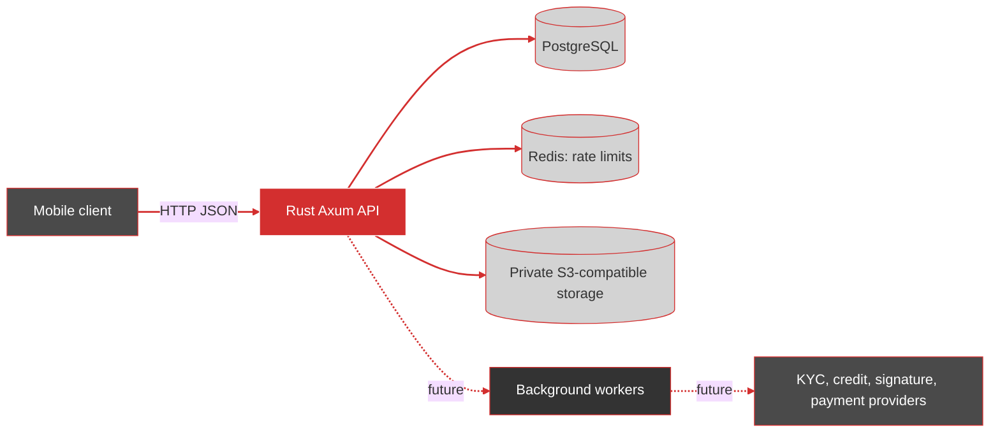

# Rho Studio Fintech Backend Architecture

## Purpose and Status

This document is the short entry point to the backend architecture. It separates
the capabilities in the running Rust service from the target lending design.
The detailed target model and delivery backlog are in [DevPlan.md](DevPlan.md);
account, loan, and payment rules are in [banking-domain.md](banking-domain.md).

| Area | Current implementation | Target |
| --- | --- | --- |
| HTTP API | Health/version, authentication/session, consent | Customer, account, loan, and payment APIs |
| Domain | Consent transitions and event mapping | Separate identity, onboarding, account, lending, servicing, and ledger policies |
| Persistence | PostgreSQL migrations and current auth/consent queries | Transactional domain writes, durable audit/outbox, rebuildable projections |
| Integrations | Redis rate limits and S3-compatible storage | KYC, credit, signature, payment-rail, and notification adapters |
| Money movement | Not implemented | Sandbox-first, idempotent and reconciled before any live rail |

The schema contains account, loan, event, and payment-rail tables, but schema
presence is not an implemented API or a production-ready financial workflow.
Do not treat any target endpoint or lifecycle in the design docs as currently
available.

## Runtime Topology

The diagrams use the Rho Studio palette defined in [DevPlan.md](DevPlan.md):
Rho red `#D32F2F`, slate `#4A4A4A`, charcoal `#333333`, light gray `#D3D3D3`,
and white `#FFFFFF`.

The API is a Rust modular monolith. HTTP handlers own transport concerns and
delegate business rules to `src/domain`; database, Redis, and storage code stay
behind infrastructure modules. Provider calls and financial workflows belong
in application services/adapters, not in route handlers. Redis is disposable
and must never be the authority for balances or settled payments.

The current code does not yet have application-service, worker, ledger, or
provider-adapter modules. Add those boundaries with the first vertical slice
that needs them rather than introducing empty abstractions.

## Shared Infrastructure Types

Two types underpin every handler and their design is load-bearing for correctness.

**`AppState`** composes the four long-lived dependencies — `PgPool`, Redis `ConnectionManager`, `Arc<dyn ObjectStorage>`, and `Arc<AppConfig>` — into a single `Clone` struct that Axum moves into each request. Every field is a cheap handle or an `Arc`, so `Clone` refcounts rather than copies. `AppState` has no interior mutability: each dependency is either internally synchronized (pool, Redis manager) or immutable (config, storage trait object). A type-level assertion pins the `Clone + Send + Sync + 'static` bounds so a future field that breaks them fails at the definition site rather than inside the router's type inference.

**`AppError`** implements a two-message model that is the primary defense against information disclosure:

- The internal message (`thiserror`'s `#[error("...")]`) carries full detail for `tracing::error!` and never leaves the process.
- The public message (`public_message()`) is a `&'static str` sent in the JSON body. The `&'static str` return type is deliberate — it forces the message to be a compile-time constant, so no instance-specific data (a user email, a SQL state, a provider error string) can be interpolated into the response.

Every variant maps to a stable HTTP status and a machine-readable `code()` string. Those codes are part of the public API contract. Rate-limited responses additionally emit `Retry-After`. All 5xx responses return the generic public message; the detailed error is logged server-side only.

## Financial Safety Boundaries

- The authenticated user identity is derived from the validated session. A
	request-supplied customer or account ID is only a resource selector and must
	still pass server-side ownership checks.
- Account balances, loan status, and payment settlement are server-owned facts.
	Clients may submit commands, but cannot set authoritative balances, pricing,
	underwriting decisions, or final payment outcomes.
- Financial commands must be retry-safe. Persist an idempotency key and request
	hash with the command result; same key/same request returns the prior result,
	while same key/different request conflicts.
- A provider acknowledgement is not settlement. A confirmed financial event,
	audit record, ledger posting, and outbox event must be transactionally
	consistent. Corrections use compensating entries rather than editing posted
	financial history.
- Money must use exact decimal/integer representations and explicit currency;
	never use binary floating point. Resolve the schema's `NUMERIC` versus
	target minor-unit representation before implementing financial commands.
- Webhooks are untrusted until signature, timestamp/replay, and event
	de-duplication checks pass. Reconciliation remains necessary even with
	provider idempotency.

## Persistence and Ownership

PostgreSQL is the durable system of record. Each domain owns its state changes;
cross-domain behavior is coordinated through application commands and durable
events. Read projections are rebuildable and must not become a second source of
financial truth. Existing event-store, outbox, idempotency, and RLS migrations
are schema groundwork; the current runtime does not implement their complete
processing or transaction context.

Use forward-only migrations. Never rewrite a migration already applied to an
environment. Before retiring old environment data, inventory rows and
dependencies, approve retention/deletion, verify backups, and rehearse a
scoped purge separately from application deployment.

## Deployment

The Compose stack is for local development only. It publishes the API on `8080`, binds PostgreSQL and the RustFS console to host loopback, and keeps Redis and the S3 API on the Compose network. Production requires a TLS edge, private data services, managed secrets/keys, least-privilege identities, backups with restore exercises, monitoring, and an approved operating model. See [deployment-network.md](deployment-network.md) and the production gates in [DevPlan.md](DevPlan.md).

`AppConfig` reads a typed environment (`DEV`, `TEST`, `PROD`) with per-environment validation. The boot sequence is: load config → connect to Postgres → run migrations → connect to Redis → connect to storage → build `AppState` → build router → serve. If any dependency fails to initialize, the process exits before serving traffic — there is no partial-boot state.

## Domain Map

| Context | Owns | Current status |
| --- | --- | --- |
| Identity and sessions | Credentials, refresh-token families, authentication | Delivered: self-service signup, login, refresh, logout, logout-all, me. HS256 JWTs, Argon2id, refresh rotation with reuse detection, per-request session-liveness check. P0 gaps: email verification, password reset, `kid`-based key rotation. |
| Consent | Versioned notices and append-only consent evidence | Delivered: versioned notices with SHA-256 content hash, immutable once published; append-only events with trigger-enforced immutability. Notices are not seeded — no migration, CLI, or admin endpoint populates `consent_notices`. |
| Onboarding and KYC | Verification cases, provider references, screening outcomes | Schema and handler exist; route not registered in `build_app`. No provider integration. |
| Customer accounts | Account lifecycle, holds, available funds, account history | Schema only. No account routes, no ledger, no `ledger_entries` table. |
| Lending | Applications, decisions, offers, loans, schedules | Schema/design only. No lending routes. |
| Payments and servicing | Transfers, repayment instructions, settlement, allocation | Schema/design only. No payment routes or provider integration. |
| Accounting and reconciliation | Balanced journals, settlement matching, corrections | Design/schema groundwork only. No posting engine. |

---
**[Rho.Studio®](https://rho.studio/) - Engineering Department** - Contact [alexis.tercero@rho.studio](mailto:alexis.tercero@rho.studio)